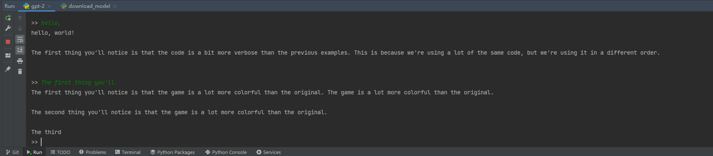

# GPT-2


GPT-2本地使用示例。

- 依赖环境
  ```  
  keras-gpt-2==0.17.0
  tensorflow==2.5.0
  requests==2.30.0
  six==1.15.0
  tqdm==4.65.0
    ```
- 使用
  1. 下载模型文件（手动下载：[夸克网盘](https://pan.quark.cn/s/2ad13f09b7cd)）
  ```
  >>> python download_model.py
  ```
  2. 运行 GPT-2
  ```
  >>> python gpt-2.py
  ```

- 运行效果

  [文本生成]
  
